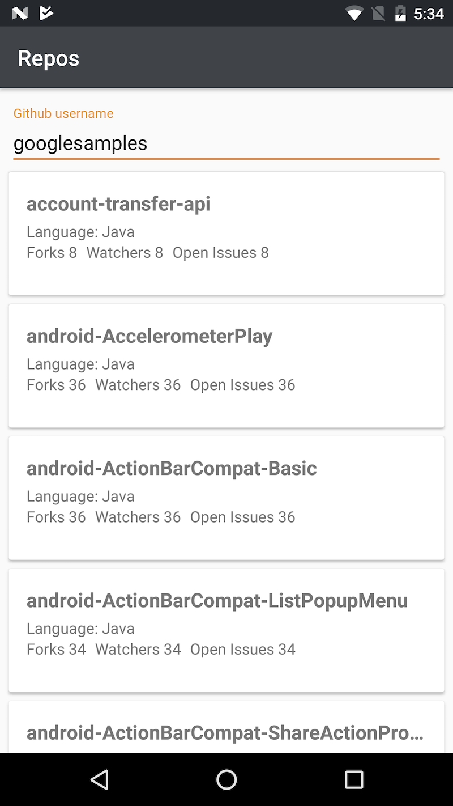

# GithubRepos

Android app to display a list of repositories for a given Github username

Key features:
- Kotlin
- Clean Architecture, Repository Pattern, MVVM
- Android Architecture Components: LiveData, ViewModel, Room
- Retrofit2, Moshi
- Dagger2
- RecyclerView, Infinite scroll, Multiple ViewTypes
- Pagination

Screenshots:

